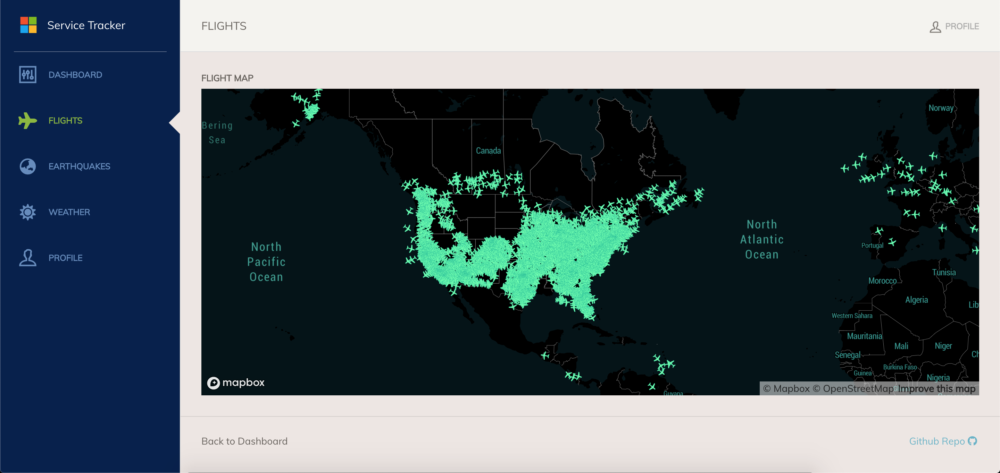

## Service Tracker Example

This is an example microservices application with a Javascript Web UI, a
Postgres database, and a series of API microservices. 
The idea is that various app developers would create Components for their
corresponding apps. 
The overall config will add traits and allow the app to be fully deployed. 
The application being deployed is shown in the following diagram:


> Full application original source here:
> https://github.com/chzbrgr71/service-tracker

In this example, there are various roles that handle each aspect of the OAM
application.

* UI Developer
* API Microservices Developer
* Postgres Admin
* App Operator / SRE (handles application deployment in Kubernetes)

## Quickstart: Deploy the sample through KubeVela

There is one UI microservice, four API microservices and one Postgres database.
Each team is responsible for delivering the component for their microservice.

1. Install the `Application` and `ComponentDefinition`.

    ```
    kubectl create -f ./KubeVelaManifest/
    ```
2. Access `localhost/` to visit the Service Tracker website. 
   Refresh the data on the dashboard for each of the microservices.


3. Once the data is refreshed, hitting the **Flights**, **Earthquakes** or
   **Weather** tabs on the left, will provide up-to-date information.


