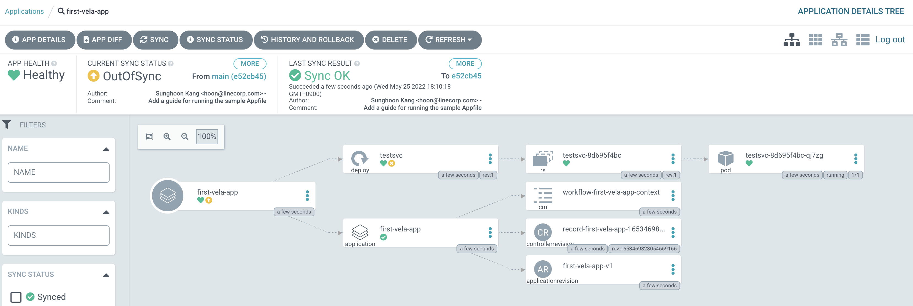

# argocd-kubevela-appfile

Deploy KubeVela [Appfile](https://kubevela.io/docs/developers/learn-appfile) with ArgoCD 📦

## Prerequisites

- Kubernetes Cluster (e.g. Docker Desktop Kubernetes)
  > NOTE: **Empty cluster** is recommended since following instructions might break your cluster

### Required Tools 🛠

- [Taskfile](https://taskfile.dev)
- [ArgoCD CLI](https://argo-cd.readthedocs.io/en/stable/getting_started/#2-download-argo-cd-cli)
- [Helm](https://helm.sh)
- [Helmfile](https://github.com/helmfile/helmfile)
  - [helm-diff](https://github.com/databus23/helm-diff)
- [kubectl](https://kubernetes.io/docs/tasks/tools)

## Install base components

First, we need both [Argo CD](https://github.com/argoproj/argo-cd) and [KubeVela](https://kubevela.io) in the cluster. For Argo CD, we need to configure [Config Management Plugin](https://argo-cd.readthedocs.io/en/stable/user-guide/config-management-plugins) let Argo CD know how to treat the KubeVela Appfile.

> You can check configuration in [argocd/values.yaml](./deployments/infra/argocd/values.yaml).

To install both components, run the following command in the shell:

```sh
# This command will install `Argo CD` and `KubeVela` through `Helmfile`.
task infra:deploy
```

## Deploy Appfile

Then, we need to open the tunnel for Argo CD CLI to communicate with the server.

```sh
# This command will forward the Argo CD server port
task argo:proxy
```

Let's log in to Argo CD in the other session:

```sh
# This command will print the initial admin credential and log in to Argo CD
task argo:login

# Output:
# > ArgoCD Username: admin / Password: <plain-password>
# > 'admin:login' logged in successfully
# > Context 'localhost:8080' updated
```

Finally, it's time to deploy the [sample Appfile](./sample/appfile.yaml).

```sh
task argo:create-vela-app
```

You can check the Application status on the dashboard (https://localhost:8080) 🥳



---

## References

- [Argo CD | Plugins](https://argo-cd.readthedocs.io/en/stable/user-guide/config-management-plugins)
- [CNCF Blog | ArgoCD + KubeVela: GitOps with Developer-centric Experience](https://www.cncf.io/blog/2020/12/22/argocd-kubevela-gitops-with-developer-centric-experience)
