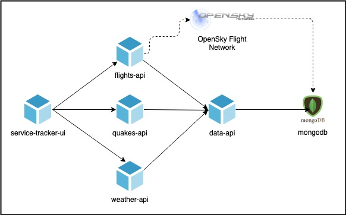
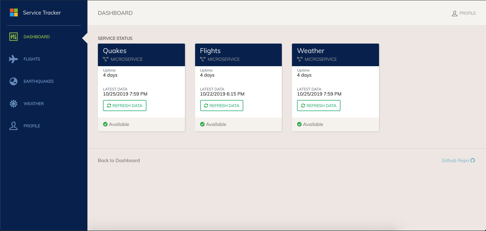
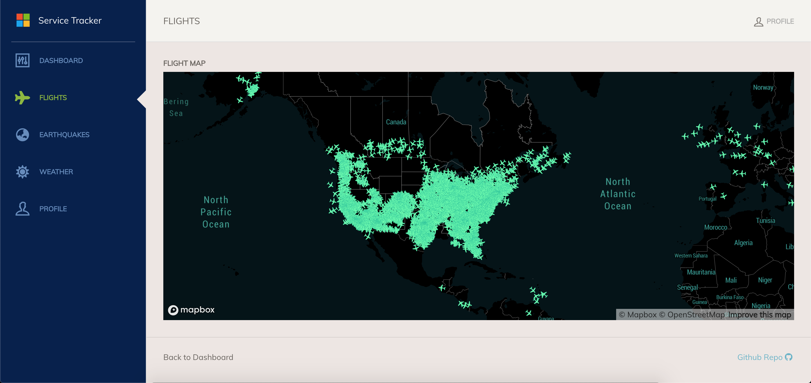

## Service Tracker Example

This is an example microservices application with a Javascript Web UI, a
Postgres database, and a series of API microservices. The idea is that various
app developers would create Components for their corresponding apps. The overall
config will add traits and allow the app to be fully deployed. The application
being deployed is shown in the following diagram:



> Full application original source here:
> https://github.com/chzbrgr71/service-tracker

In this example, there are various roles that handle each aspect of the OAM
application.

* UI Developer
* API Microservices Developer
* Postgres Admin
* App Operator / SRE (handles application deployment in Kubernetes)

## Quickstart: Deploy the sample to Crossplane running on any Kubernetes cluster

### Pre-requisites for this sample

* [Install Helm 3](https://crossplane.io/docs/v0.9/install.html#pre-requisites)
* [Install kubectl](https://crossplane.io/docs/v0.9/install.html#pre-requisites)
* A running Kubernetes cluster.

### Infrastructure Operator: Install Crossplane

As an infrastructure operator, I choose to set up the Kubernetes cluster with
Crossplane.

* Install either the
  [local](https://github.com/crossplane/addon-oam-kubernetes-local) OAM addon following its instructions 
  or install both [Crossplane](https://crossplane.io/docs/v0.9/install.html) and 
  [remote](https://github.com/crossplane/addon-oam-kubernetes-remote) OAM addon.
* [Install the infrastructure
  provider](https://crossplane.io/docs/v0.9/install.html#installing-infrastructure-providers)
  for the cloud of your choice.
* [Configure credentials](https://crossplane.io/docs/v0.9/configure.html)
  between cloud provider.
* Define any [resource classes](https://crossplane.io/docs/v0.9/dynamic.html) so
  that components that dynamically provision cloud infrastructure can be
  defined.

I also define a set of workloads and traits that can be used by application
developers when defining components. For this demo, it is necessary to create a
`WorkloadDefinition` for the `ContainerizedWorkload` and `PostgreSQLInstance`
workload types, and a `TraitDefinition` for the `ManualScalerTrait` type.

    ```
    kubectl apply -f Definitions/ -R
    ```

### Application Developer: Authoring and registering components

There is one UI microservice, four API microservices and one Postgres database.
Each team is responsible for delivering the component schematic for their
microservice. The Postgres database can either be run in-cluster or be consumed
as a managed service from a cloud provider. 

1. The **OAM Components** that are applied require the following information
   about the app from the developers:

    * The workload type, which dictates how the microservice is supposed to run.
      In this example, all microservices are of type `ContainerizedWorkload`.
      The Postgres database is of type `PostgreSQLInstance`.
    * The container image and credentials. Developers are responsible at the
      very least for authoring the Dockerfiles containing the dependencies in
      order to build their runnable container. This example also expects an
      image to be pushed to a registry although this can be handled by a
      continuous integration system.
    * Container ports that expose any ports that servers are listening to.
    * Parameters that can be overridden by an operator at time of instantiation.

2. Register the `Components`.

    ```
    kubectl apply -f tracker-managed-db-component.yaml
    kubectl apply -f tracker-data-component.yaml
    kubectl apply -f tracker-flights-component.yaml
    kubectl apply -f tracker-quakes-component.yaml
    kubectl apply -f tracker-weather-component.yaml
    kubectl apply -f tracker-ui-component.yaml
    ```

*Note: if you prefer to run the Postgres database in-cluster using a
`ContainerizedWorkload`, register the `tracker-db-component.yaml` instead of the
`tracker-managed-db-component.yaml`.*

### Application Operator: Instantiate application with appropriate configuration

The application operator (this may or may not be different than the developer)
tasks involve running the application with appropriate configurations.

1. This **OAM ApplicationConfiguration** instantiates each of the components and
   allows the operator to tune the following when running the components:

    * Number of replicas for each component
    * Values for any parameters that can be overridden in the components.

2. Install the `ApplicationConfiguration`.

    ```
    kubectl create -f ApplicationConfiguration/tracker-app-config-managed.yaml
    ```

*Note: if you prefer to run the Postgres database in-cluster, install the
`track-app-config.yaml` `ApplicationConfiguration` instead of
`tracker-app-config-managed.yaml`.*

3. Fine the external IP of the UI microservice

    If using the local OAM Crossplane addon:

    ```
    kubectl get svc web-ui -o=jsonpath={.status.loadBalancer.ingress[0].ip}
    ```

    If using the remote OAM Crossplane addon:

    ```
    kubectl get kubernetesapplicationresources web-ui-service -o=jsonpath={.status.remote.loadBalancer.ingress[0].ip}
    ```

4. Add the following to your `/etc/hosts` file so you can access the endpoint
   using the host (servicetracker.oam.io).

    ```
    <web-ui-ip-address> servicetracker.oam.io
    ```

5. Visit your browser and type in `servicetracker.oam.io` for the Service
   Tracker website. Refresh the data on the dashboard for each of the
   microservices.



6. Once the data is refreshed, hitting the **Flights**, **Earthquakes** or
   **Weather** tabs on the left, will provide up-to-date information.


