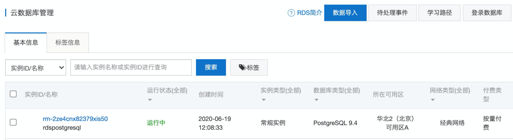
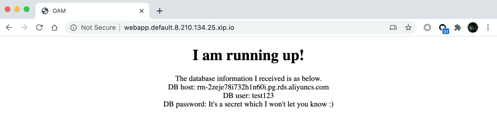

# How Knative interacts with cloud resource provisioned by OAM
This app demonstrates how OAM helps Knative Configuration/Route to interact with cloud resources provisioned
by Crossplane.

## Prerequisites
- Helm v3

- OAM Kubernetes Runtime
```
kubectl create namespace crossplane-system
helm repo add crossplane-alpha https://charts.crossplane.io/alpha
helm install addon-oam-kubernetes-local --namespace crossplane-system crossplane-alpha/oam-core-resources
```

- Crossplane v0.11

Please refer to `Install Crossplane` in [documentation](https://crossplane.io/docs/v0.11/getting-started/install-configure.html). 

- Crossplane Alibaba Cloud provider v0.1.0

Please refer to `Select Provider` and install Alibaba Cloud provider in [documentation](https://crossplane.io/docs/v0.11/getting-started/install-configure.html). 

- Knative Serving v0.14

Please refer to [Install Knative](https://knative.dev/v0.14-docs/install/any-kubernetes-cluster/), remember to 1) pick 
`Istio` as the networking layer and 2) choose `Magic DNS (xip.io)` to configure DNS.

If you have trouble getting images from gcr.io, you can try replace images:

* gcr.io/knative-releases/knative.dev/serving/cmd/activator@sha256:3b530bbcf892aff098444ae529a9d4150dfd0cd35c97babebd90eedae34ad8af
=> wonderflow/knative-activator:v1

* gcr.io/knative-releases/knative.dev/serving/cmd/autoscaler@sha256:bd125e90fffb44b843a183aa00f481cddee2317c0cfde9151c2482c5c2a8ed71  
=> wonderflow/knative-autoscaler:v1

* gcr.io/knative-releases/knative.dev/serving/cmd/controller@sha256:71f7c9f101e7e30e82a86d203fb98d6fa607c8d6ac2fcb73fd1defd365795223
=> wonderflow/knative-controller:v1

* gcr.io/knative-releases/knative.dev/net-istio/cmd/webhook@sha256:b04b047b1c980191bcfb046b97ab0afd39e19e570be341ce0028483fc548aa22
=> wonderflow/knative-istio-webhook:v1

* gcr.io/knative-releases/knative.dev/net-istio/cmd/controller@sha256:d31c49a1f07584f0393d651b4f9befb845e64e6b55c9d244e046f309560b6d0e
=> wonderflow/knative-networking-istio:v1

* gcr.io/knative-releases/knative.dev/serving/cmd/webhook@sha256:90562a10f5e37965f4f3332b0412afec1cf3dd1c06caed530213ca0603e52082 wonderflow/knative-webhook:v1

* gcr.io/knative-releases/knative.dev/serving/cmd/default-domain@sha256:3f9f0baebbb2ace4aaa6f38537f2a76aa9f02669d43b1a9d8386bf6497559257
=> wonderflow/knative-default-domain:v1

// kubectl -n knative-serving edit configmap config-deployment
* gcr.io/knative-releases/knative.dev/serving/cmd/queue@sha256:f32c20456c6349a4fe99c83060009c7e9f6ba0c644ef854a04514e1f8aca982e
=> wonderflow/knative-queue:v1

## Apply RBAC manifest
Apply [rbac.yaml](./rbac.yaml).

```shell script
$ kubectl apply -f rbac.yaml
clusterrole.rbac.authorization.k8s.io/oam-knative-clusterrole created
clusterrolebinding.rbac.authorization.k8s.io/oam-knative created
```

## Apply TraitDefinition to make Knative Route as Trait

```
$ kubectl apply -f route-trait-definition.yaml
```

## Prepare cloud resource

Take Alibaba Cloud RDS resource `Postgresql` as a cloud resource example. Use RDS isntance `RDSInstance` as the workload of
OAM Component `db`. `spec.forProvider.engine`, `spec.forProvider.engineVersion` and  `spec.forProvider.masterUsername`
represent the engine type, version and username of a database instance in file `component-postgresql.yaml`.

```yaml
apiVersion: core.oam.dev/v1alpha2
kind: Component
metadata:
  name: db
spec:
  workload:
    apiVersion: database.alibaba.crossplane.io/v1alpha1
    kind: RDSInstance
    metadata:
      name: rdspostgresql2
    spec:
      forProvider:
        engine: PostgreSQL
        engineVersion: "9.4"
        dbInstanceClass: rds.pg.s1.small
        dbInstanceStorageInGB: 20
        securityIPList: "0.0.0.0/0"
        masterUsername: "test123"
      writeConnectionSecretToRef:
        namespace: default # crossplane-system
        name: alibaba-rdspostgresql-conn
      providerRef:
        name: alibaba-provider
      reclaimPolicy: Delete
```

Prepare this component into K8s cluster by:

```
$ kubectl apply -f Components/component-postgresql.yaml
component.core.oam.dev/db created
```

## Prepare Application

We have written a simple application [flask-web-application](./App) for this demo.
It's very simple as it will exit if environment variables `DB_HOST`,
`DB_USER` and  `DB_PASSWORD` could NOT be retrieved, or it will print those database connection information on the home
page `index.html`.

The main logic of this app is like below:

```python
host = os.getenv("DB_HOST")
user = os.getenv("DB_USER")
password = os.getenv("DB_PASSWORD")

if not (host and user and password):
    print('Could NOT retrieve DB information from environment variables. Exiting...')
    sys.exit(-1)


@application.route('/')
def index():
    print(1)
    return render_template("index.html", host=host, user=user)
```

We have built an image for this app `oamdev/postgresql-flask-web-application:v0.1`. 

Compose the application as Knative Configuration which works as the component of Component `webapp` in file 
`component-knative-configuration-flask-app.yaml`.

```yaml
apiVersion: core.oam.dev/v1alpha2
kind: Component
metadata:
  name: webapp
spec:
  workload:
    apiVersion: serving.knative.dev/v1
    kind: Configuration
    metadata:
      name: webapp
      namespace: default
    spec:
      template:
        spec:
          containers:
            - image: oamdev/postgresql-flask-web-application:v0.1
              name: webapp
              env:
                - name: DB_HOST
                  valueFrom:
                    secretKeyRef:
                      key: endpoint
                - name: DB_USER
                  valueFrom:
                    secretKeyRef:
                      key: username
                - name: DB_PASSWORD
                  valueFrom:
                    secretKeyRef:
                      key: password
              ports:
                - containerPort: 80
                  name: http1 # Must be one of "http1" or "h2c" (if supported). Defaults to "http1".
          timeoutSeconds: 600
```

Prepare this component into K8s cluster by:

```
$ kubectl apply -f Components/component-knative-configuration-flask-app.yaml
component.core.oam.dev/webapp created
```


## Deploy Application

Compose cloud resource Component `db` and front web application Component `webapp` as ApplicationConfiguration
`knative-postgresql-appconfig` in `appconfig-1.yaml`.

```yaml
apiVersion: core.oam.dev/v1alpha2
kind: ApplicationConfiguration
metadata:
  name: knative-postgresql-appconfig
spec:
  components:
    - componentName: webapp
      dataInputs:
        - valueFrom:
            dataOutputName: alibaba-rdspostgresql-conn
          toFieldPaths:
            - spec.template.spec.containers[0].env[0].valueFrom.secretKeyRef.name
            - spec.template.spec.containers[0].env[1].valueFrom.secretKeyRef.name
            - spec.template.spec.containers[0].env[2].valueFrom.secretKeyRef.name

    - componentName: db
      dataOutputs:
        - name: alibaba-rdspostgresql-conn
          fieldPath: "spec.writeConnectionSecretToRef.name"
          conditions:
            - op: eq
              value: Running
              fieldPath: "status.atProvider.dbInstanceStatus"
```

In a Kubernetes cluster, submit manifests of these two components and the ApplicationConfiguration.

```shell
✗ kubectl apply -f appconfig-1.yaml
applicationconfiguration.core.oam.dev/knative-postgresql-appconfig configured
```

By checking the list of Component, two components `db` and `webapp` are provisioned. After several minutes,
the statue of RDSInstance will become to `Running`.
```shell
$ kubectl  get component
NAME        WORKLOAD-KIND
db          RDSInstance
webapp      Configuration

$ kubectl get RDSInstance
NAME             READY   SYNCED   STATE      ENGINE       VERSION   AGE
rdspostgresql3   True    True     Running    PostgreSQL   9.4       11m
```
At this time, a Postgresql instance is provisioned, and we can see it from Alibaba Clod console.
<br />

The application `webapp` also generates a Knative Configuration.

```shell
$ kubectl get configuration
NAME     LATESTCREATED   LATESTREADY    READY   REASON
webapp   webapp-c8s4n    webapp-c8s4n   True
```

Edit `appconfig-1.yaml`, add Knative Route with the latest revision of Configuration as shown in `appconfig-2.yaml` and submit it.

```shell
apiVersion: core.oam.dev/v1alpha2
kind: ApplicationConfiguration
metadata:
  name: knative-postgresql-appconfig
spec:
  components:
    - componentName: webapp
      dataInputs:
        - valueFrom:
            dataOutputName: alibaba-rdspostgresql-conn
          toFieldPaths:
            - spec.template.spec.containers[0].env[0].valueFrom.secretKeyRef.name
            - spec.template.spec.containers[0].env[1].valueFrom.secretKeyRef.name
            - spec.template.spec.containers[0].env[2].valueFrom.secretKeyRef.name
      traits:
        - trait:
            apiVersion: serving.knative.dev/v1
            kind: Route
            spec:
              traffic:
                - configurationName: webapp
                  percent: 100
    - componentName: db
      dataOutputs:
        - name: alibaba-rdspostgresql-conn
          fieldPath: "spec.writeConnectionSecretToRef.name"
          conditions:
            - op: eq
              value: Running
              fieldPath: "status.atProvider.dbInstanceStatus"
```

Check the status of Knative Route.
```shell
$ kubectl get route
NAME     URL                                         READY   REASON
webapp   http://webapp.default.8.210.134.25.xip.io   True
```

The status will become `True` very quickly. Visit the `URL` in a web browser and check the home page of our application.

Bingo!


Have fun with OAM and Knative.
