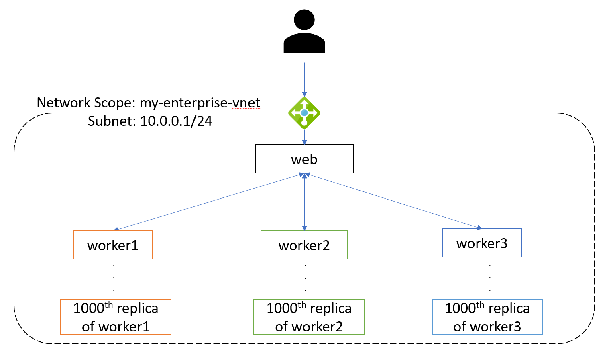

# Hydra Example: Fireworks 

## Introduction 
This folder contains the source code and documentation on the fireworks demo running on the Hydra Managed Service (soon also on the open source implementation). 

## Purpose 

The purpose of this proof-of-concept is as follows: 

- Illustrate that applications defined with the Mesh specification can be defined using the Hydra spec

- Within the specification, this will stress test the following:
    - Reuse components
    - Service discovery 
    - Manual scaling 
    - Public Ingress 
    - Network Scope (bringing existing network)

## Out of Scope 

This proof of concept is not concerned with addressing the following: 

- Separation of concerns and the personas that author each of the YAML files 
- Local development of indvidual services
- Dependency management and testing during development
- Handoff between development and operations including a CI/CD pipeline 
- Any part of the Hydra specification not explicitly mentioned in the **Purpose**

## Scenario & Architecture 

The goal of this application is to build a basic scalable application into an organizations existing Virtual Network. The assumption is that the development team has tested their code and are authoring their `component.yaml` file. 

The Fireworks application is split into two parts. The `workers` ping the frontend every **x** secondsd with the color of their firework. The `web` is responsible for simply displaying the color of the fireworks. 

