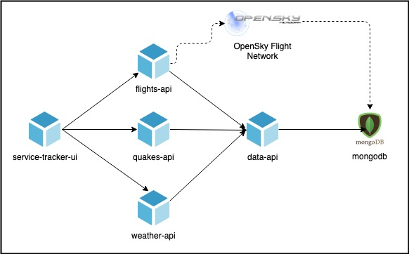

## Service Tracker Example

The application being deployed is shown in the following diagram: 



In this example, there are various roles that handle each aspect of the Hydra application.

* UI Developer
* API Microservices Developer
* MongoDB Admin
* App Operator / SRE (handles applicaiton deployment in Kubernetes)

### Deploying to Kubernetes

The Kubernetes cluster must have the Operator deployed. This can be found here: https://github.com/microsoft/scylla 

1. Once scylla is installed in the cluster, first add the `ComponentSchematics`

    ```
    kubectl apply -f ./service-tracker/k8s/tracker-db-component.yaml
    kubectl apply -f ./service-tracker/k8s/tracker-api-components.yaml
    kubectl apply -f ./service-tracker/k8s/tracker-ui-component.yaml
    ```

2. Then install the `OperationalConfiguration`

    ```
    kubectl apply -f ./service-tracker/k8s/tracker-app-config.yaml
    ```

### Deploying to Azure Managed Service

TBD